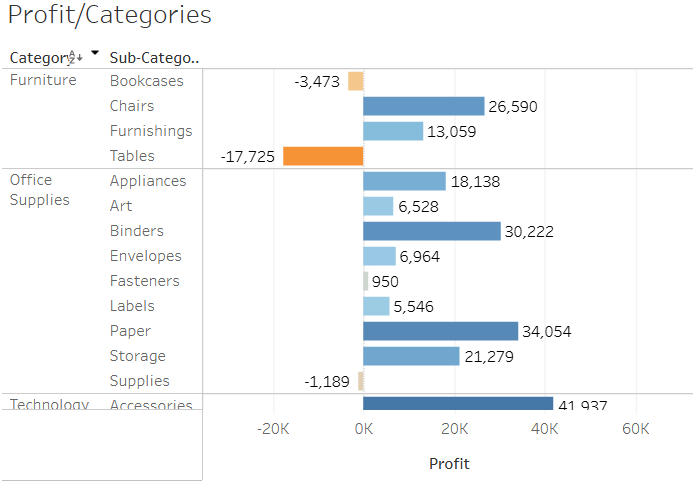
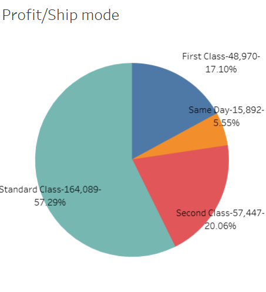
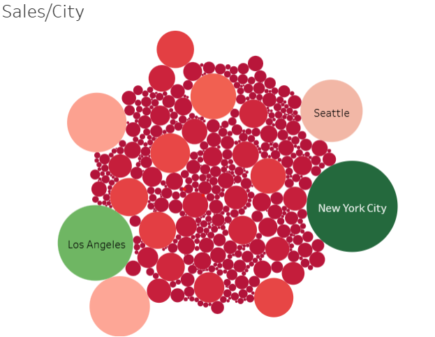
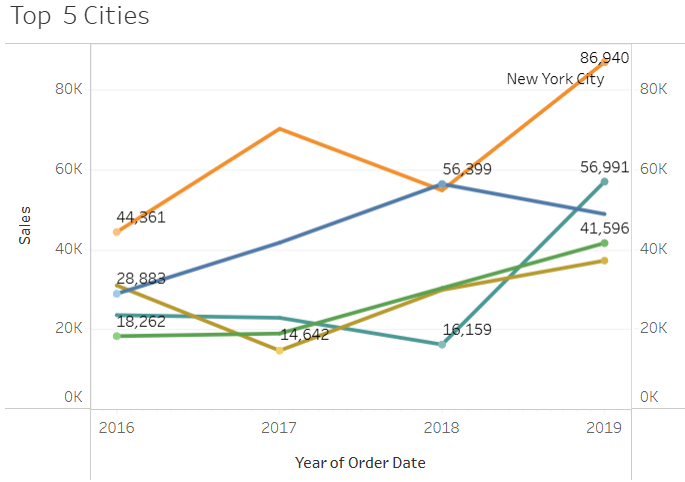
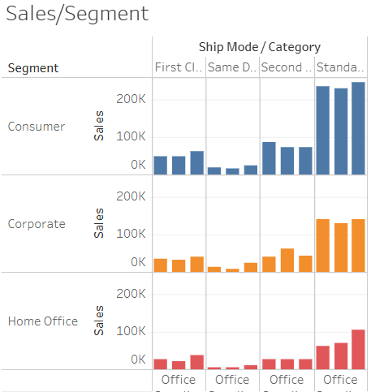
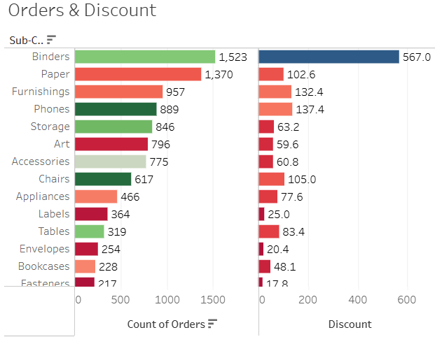
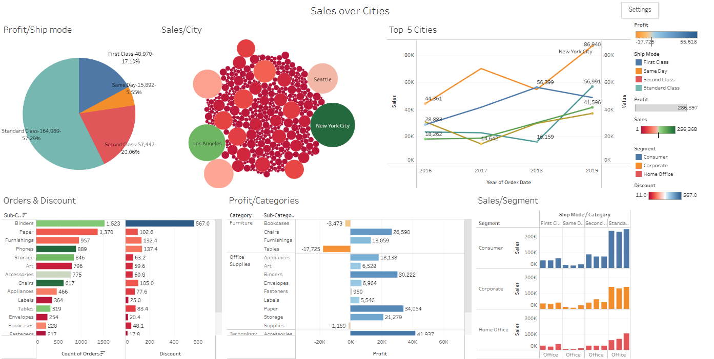

# 📊 Tableau Project_Sales over Cities

Welcome to an interactive data visualization project using the iconic **Superstore Dataset**. In this project, I use **Tableau** to explore and visualize key sales dynamics across different U.S. cities and customer segments through insightful and polished dashboards.

This dataset contains detailed transactional information from a fictional retail business called the "Superstore" dataset. 
It represents sales transactions from a fictional retail company that sells office supplies and furniture. It captures detailed information about customer orders, products,
shipping and profitability across different regions.
The dataset is a simulated snapshot of multi-year retail operations for an office supply and furniture store that serves customers across various U.S. regions.
It captures key elements of a business's sales pipeline, including customer behavior, order fulfillment, shipping logistics, product categories and financial performance (sales, discounts, and profits).

---

## 🛍️ About the Dataset

The **Superstore Dataset** is a fictional but realistic snapshot of a retail company’s operations over several years. It captures:

- 🧾 **Sales transactions**
- 👤 **Customer segmentation**
- 📦 **Product hierarchy (Category & Sub-Category)**
- 🚚 **Shipping modes**
- 🌍 **Geographic spread across U.S. regions**
- 💰 **Financials: Sales, Discounts & Profit**

The dataset is ideal for business intelligence, dashboard creation and storytelling through visual data analytics.

---

## 🎯 Project Objective

The main goal is to explore **city-level sales performance** and analyze profit, discount behavior and customer preferences using different Tableau charts.

---

## 🧪 Tasks & Visualizations

### ✅ Task 1: Profit by Category & Sub-Category (Horizontal Bar Chart)

- A **horizontal bar chart** displaying total **Profit** per **Category** and **Sub-Category**
- Enhanced with color intensity and data labels for easier comparison
- ✅ *Insight:* Identify which product lines drive the most profit

---

### ✅ Task 2: Profit by Ship Mode (Pie Chart)

- A **pie chart** visualizing **Profit** distribution by **Ship Mode**
- Labels include:
  - 🚢 **Ship Mode**
  - 💰 **Profit Amount**
  - 📊 **Percentage of Total Profit**

🧠 *Example:* `Standard Class – $164,089 – 57.29%`

---

### ✅ Task 3: Sales by City (Bubble Chart)

- A **bubble chart** showing **Sales volume per City**
- Cities with higher sales appear as **larger bubbles** and lower-sales cities are **smaller**
- 🔵 Color gradient used to visualize differences in sales

---

### ✅ Task 4: Sales Trends of Top 5 Cities (Line Chart)

- A **continuous line chart** of **Sales over time (2016–2019)** for the **top 5 cities by total sales**
- Each line represents a city and is colored uniquely
- 📍 *Min/Max points* are labeled for each city
- 🎯 *Insight:* Spot seasonal spikes and city performance trends

---

### ✅ Task 5: Sales by Segment, Category & Ship Mode (Column Chart)

- A **clustered column chart** visualizing:
  - **Sales** on the Y-axis
  - Grouped by **Segment**, **Category** and **Ship Mode** on the X-axis
- Bars are **colored by Segment** for better segmentation

---

### ✅ Task 6: Discount vs Number of Orders (Dual Horizontal Bar Chart)

- A **dual-axis bar chart** per **Sub-Category** showing:
  - Average **Discounts**
  - Total **Order Counts**
- Independently colored and labeled
- 📊 *Insight:* Assess whether higher discounts correlate with more orders

---

### ✅ Task 7: Final Dashboard

- A **composite Tableau Dashboard** combining all six visualizations
- Unified filters across charts for user interactivity
- 🔒 *Exceptions:* Task 4 (Line Chart) and Task 5 (Segment Chart) are excluded from filter actions to preserve context

---

---
## 🖥️ Tools Used

- [**Tableau Desktop**](https://www.tableau.com/)
- 📂 Superstore Dataset (default sample or from [Kaggle](https://www.kaggle.com/datasets/vivek468/superstore-dataset-final))
- 📐 Visual best practices for business dashboards

---

## 💡 Outcome

This project showcases the ability to:

- Clean and analyze business data
- Translate insights into compelling visualizations
- Design user-friendly Tableau dashboards
- Tell impactful stories with data

---
🔗 [View Full Dashboard on Tableau Public](https://public.tableau.com/app/profile/konstantinos.kitsantas/viz/SalesoverCities_17296817539510/Dashboard1)
